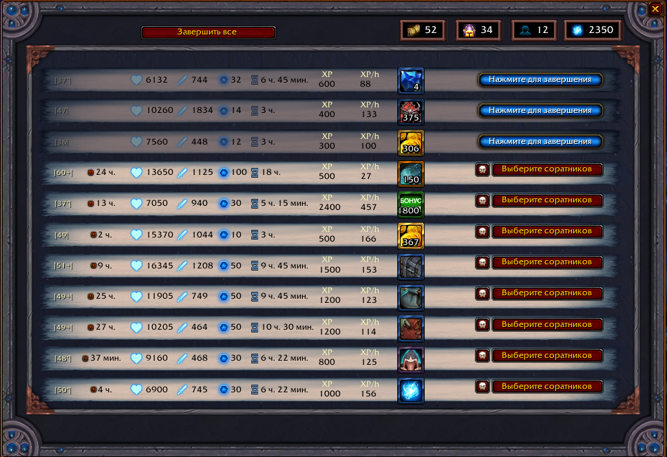
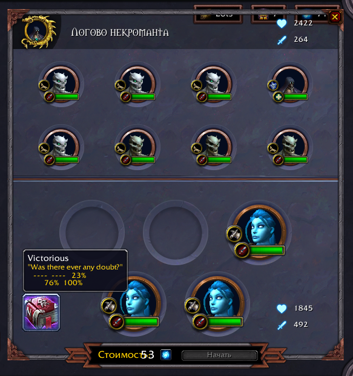

### Venture Plan [mod]

Venture Plan modifies the Command Table interface for Adventure missions, showing you a more detailed overview of the available missions, and revealing additional information about adventure combat mechanics. The included Cursed Adventurer's Guide is able to foretell your companions' gruesome demise before you send them off on that fatal mission.

Please note that the included Cursed Adventurer's Guide is cursed, and may not always provide accurate visions of the future. As your companions complete adventures, you will accumulate Adventure Reports in-game. Missions where the Guide is particularly likely to be wrong are marked with a warning sign.

### Modification

1. Changed mission list to default

Actually you can additionally mod it by WeakAuras.

On screenshot I use [this one](https://wago.io/2c5uE2huK) for expiring timer.

2. Shows remaining health after fight simulation

Beware: sometimes different simulations shows slightly different health (probably due to random targeting).

### Attribution

Original [Venture Plan](https://www.townlong-yak.com/addons/venture-plan) written by **Foxlit**.
 
Thanks for awesome math model and first real fight simulation.
